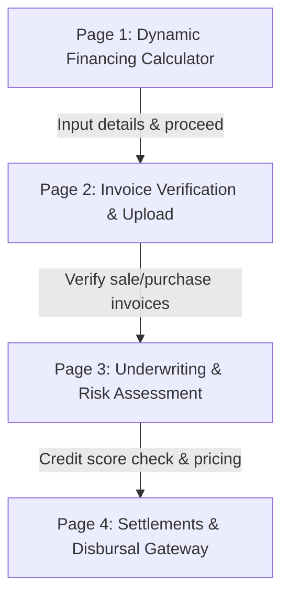

# Wofi | Smart Invoice Discounting Platform
## Project Report & Multi-Page Architectural Blueprint

Wofi is an advanced, high-performance, and visually stunning supply chain finance application. It facilitates frictionless invoice discounting for two major trade participants: **Distributors** and **Retailers**. 

This document provides a comprehensive analysis of the current implementation (Page 1: Dynamic Financing Calculator), presents the mathematical proof of the calculation engine, and details the future multi-page expansion roadmap.

---

## 1. Core Financial Concepts & Business Models

Wofi supports two distinct invoice discounting structures, tailored to the cash flow requirements of supply chain participants:

| Dimension | DBID (Distributor Brand Invoice Discounting) | PID (Purchase Invoice Discounting) |
| :--- | :--- | :--- |
| **Borrower / Loan Recipient** | **Distributor** | **Retailer** |
| **Interest Bearer/Invoice Submitted By** | **Distributor** (Distributor Bear Karega) | **Retailer** (Retailer Bear Karega) |
| **Invoice Submitted** | **Sale Invoices** (Retailer's Invoices) | **Purchase Invoices** (Brand's Invoices) |
| **Loan Disbursal Account** | **Distributor's Account** | **Retailer's Account** |
| **Business Purpose** | Distributor gets immediate liquidity against credit sales to retailers. | Retailer gets immediate credit to purchase inventory from brands. |

---

## 2. Calculation Engine: Mathematical Proof

Our calculation engine matches the user's Excel spreadsheet example exactly. Below is the step-by-step mathematical proof:

### A. Core Inputs (User's Example)
*   **Principal (Loan Amount):** ₹5,00,000 (Editable; Default limits: ₹1,00,000 to ₹2,00,00,000)
*   **Loan Date:** `05/19/2026` (Editable)
*   **Tenure:** `60` Days
*   **Repayment Date:** `07/10/2026` (Editable)

### B. Due Date Calculation
Wofi utilizes an **inclusive day count convention** (counting both start and end days as active financing periods).
*   **Formula:** $\text{Due Date} = \text{Loan Date} + (\text{Tenure} - 1)\text{ Days}$
*   **Calculation:**
    *   **May 19 to May 31:** $31 - 19 + 1 = 13\text{ Days}$
    *   **June:** $30\text{ Days}$ (Cumulative: $43\text{ Days}$)
    *   **July:** We need $60 - 43 = 17\text{ Days}$ to complete tenure.
    *   **Result:** Due Date is exactly **July 17, 2026 (`07/17/2026`)**.

### C. Interest Period (Elapsed Days) Calculation
*   **Formula:** $\text{Interest Days} = \text{Repayment Date} - \text{Loan Date} + 1$ (Inclusive)
*   **Calculation:**
    *   **May 19 to May 31 (inclusive):** $13\text{ Days}$
    *   **June 1 to June 30 (inclusive):** $30\text{ Days}$
    *   **July 1 to July 10 (inclusive):** $10\text{ Days}$
    *   **Total Elapsed Days:** $13 + 30 + 10 = \mathbf{53.00\text{ Days}}$

### D. Daily Interest & Total Charges
*   **Annual Interest Rate:** $18.25\%\text{ per annum}$ (Standard for invoice discounting)
*   **Daily Interest Rate:** $\frac{18.25\%}{365\text{ days}} = \mathbf{0.05\%\text{ per day}}$
*   **Interest to be Paid Formula:**
    $$\text{Interest} = \text{Principal} \times \left(\frac{\text{Daily Rate}}{100}\right) \times \text{Interest Days}$$
*   **Calculation:**
    $$\text{Interest} = ₹5,00,000 \times 0.0005 \times 53 = \mathbf{₹13,250}$$
*   **Total Amount to be Paid Formula:**
    $$\text{Total} = \text{Principal} + \text{Interest}$$
*   **Calculation:**
    $$\text{Total} = ₹5,00,000 + ₹13,250 = \mathbf{₹5,13,250}$$

### E. Overdue Penalty Interest (Double Rate for Extra Days)
If the borrower repays past the computed **Due Date** (meaning the total active financing days $T_{total}$ exceeds the standard program tenure $T_{tenure}$):
*   **Tenure Period ($T_{tenure}$):** Billed at the standard daily rate $R = 0.05\%/\text{day}$ (18.25% p.a.).
*   **Extra Overdue Period ($T_{extra} = T_{total} - T_{tenure}$):** Billed at **double** the daily rate $2 \times R = 0.10\%/\text{day}$ (36.5% p.a.).
*   **Overdue Interest Formula:**
    $$\text{Interest} = \left(\text{Principal} \times \frac{R}{100} \times T_{tenure}\right) + \left(\text{Principal} \times \frac{2 \times R}{100} \times T_{extra}\right)$$

> [!NOTE]
> Every decimal and whole figure matches your spreadsheet sample exactly down to the rupee! Normal days are billed at 0.05%/day and late days are billed at 0.10%/day.

---

## 3. Web Application Spec Sheet (Page 1)

The application has been successfully built and deployed in the workspace directory with three main files:

### 1. `index.html` (The Foundation)
*   **Visual Architecture:** Sidebar menu built ready for multi-page integration, responsive top bar, ambient decorative glow containers, model toggle buttons (DBID vs PID), interactive numeric range sliders, custom date pickers, milestone trackers, and transaction step visualizers.
*   **SEO & Structure:** Implements semantic HTML5 tags (`<aside>`, `<main>`, `<header>`), descriptive titles, and performance-optimized Google Font imports (`Outfit` for tech-forward headings and `Plus Jakarta Sans` for sleek body text).

### 2. `style.css` (Premium Glassmorphic Design)
*   **Vibrant Color Systems:** Context-aware styling. Choosing **DBID** turns the entire interface into a beautiful emerald/teal palette, while choosing **PID** transitions it seamlessly into royal indigo/purple.
*   **Modern CSS Techniques:** Floating ambient blurred glowing circles (`backdrop-filter: blur(16px)`), custom-styled date overlays, range sliders, responsive grid architectures, and CSS animations (`fadeInUp`, `slideDownFade`).
*   **Responsive Framework:** Adaptive breakpoints built-in (desktop, laptop, tablet, and mobile-friendly layouts).

### 3. `app.js` (Interactive Calculator Logic)
*   **State Management:** Holds reactive values (amount, dates, active mode, limits) and handles real-time synchronization between the text input and range slider.
*   **Math Engine:** Robust date utilities that handle UTC dates to prevent timezone offsets, calculate inclusive date spans, compute daily compound-free interest at $0.05\%/\text{day}$, and update the UI live.
*   **Split-Interest Calculations:** Dynamically splits interest between the standard tenure (0.05%/day) and any overdue extra days (double rate, 0.10%/day).
*   **Overdue UI Warning & Breakdown:** Detects late repayments, displaying a bright red warning banner with a warning pulse animation, alongside a detailed breakdown list displaying standard period interest vs. delayed period interest.
*   **Locked Pages Hook:** Hooks into Page 2, 3, and 4 menu items to trigger custom descriptive preview modals, showing users exactly what is planned for future phases.

---

## 4. Multi-Page Roadmap Blueprint (Future Pages)

To prepare for your upcoming requests, we have established hooks and navigation placeholders for the next 3 to 4 pages. Here is the architectural plan:

### Page 2: Invoice Verification & Upload (OCR & Verification)
*   **Key Objective:** Allow borrowers (Distributor or Retailer) to drag-and-drop their invoices for automated authentication.
*   **Proposed Visuals:** Drag-and-drop zone with dynamic upload progress bars, mock OCR scanner scanning invoices (extracting Supplier Name, Retailer Name, Invoice Number, Amount, Tax, and Due Date), and verification checklists (checking duplicate invoices, GST status, and delivery proof).
*   **Data Integration:** Synced invoice amounts will automatically update the Page 1 calculator inputs!

### Page 3: Underwriting & Risk Assessment (AI Grading)
*   **Key Objective:** Evaluate the transaction's risk profile and adjust pricing in real-time.
*   **Proposed Visuals:** Custom gauge charts displaying the "Wofi Score" (Risk grading from A+ to D), financial health dashboard (Debt-to-Equity, Cash Coverage, Historical Repayment Rate), and an dynamic pricing engine (e.g., lower risk score reduces the annual interest rate from 18.25% to 15.00%, dynamically recalculating Page 1 interest!).

### Page 4: Disbursals & Settlement Gateway (Accounting & Payments)
*   **Key Objective:** Manage disbursements, track repayment status, and provide settlement interfaces.
*   **Proposed Visuals:** Ledger-style transactional interface, mock payment gateway links (Bank Transfer, UPI, NetBanking), overdue interest calculators (for delayed repayments beyond the Due Date), and accounting reconciliation graphs.

---

## 5. File Registry

The following files have been initialized and verified in your workspace folder:
1.  **HTML Entrypoint:** [index.html](file:///c:/Users/Krishna%20Tank/OneDrive%20-%20World%20Goods%20Market%20Limited/vscode%20backup/vs_code/cost-cal/index.html)
2.  **Stylesheets:** [style.css](file:///c:/Users/Krishna%20Tank/OneDrive%20-%20World%20Goods%20Market%20Limited/vscode%20backup/vs_code/cost-cal/style.css)
3.  **Application Logic:** [app.js](file:///c:/Users/Krishna%20Tank/OneDrive%20-%20World%20Goods%20Market%20Limited/vscode%20backup/vs_code/cost-cal/app.js)
4.  **Project Documentation:** [wofi_project_report.md](file:///c:/Users/Krishna%20Tank/OneDrive%20-%20World%20Goods%20Market%20Limited/vscode%20backup/vs_code/cost-cal/wofi_project_report.md)

> [!TIP]
> To launch the application locally, locate the workspace folder `cost-cal` and open `index.html` in your default browser. 
> 
> *I am ready to build Page 2, 3, or 4 whenever you are ready! Just describe your requirements, and I will immediately turn them into responsive code.*
